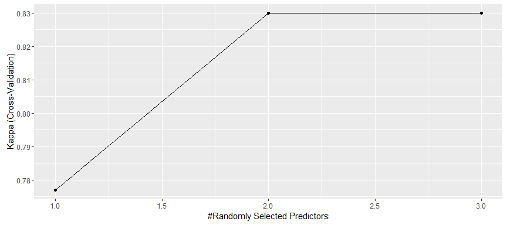
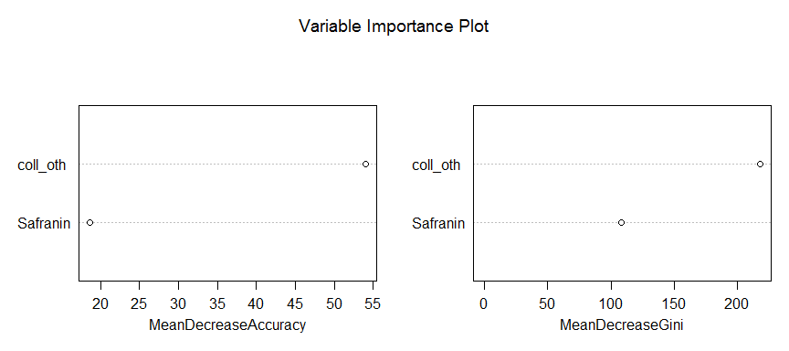
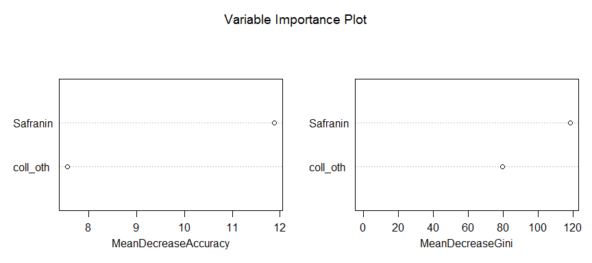
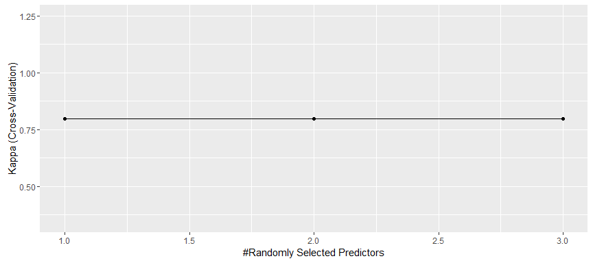
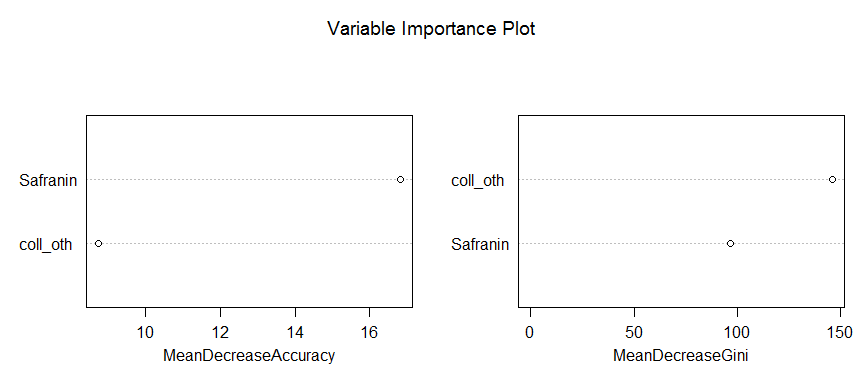

# TD 2009: Classification (P vs. D)
Vilmantas Gėgžna  

Document created on: 2016-06-22 19:01:14  
 


Klasifikacija
==============

Šiame pavyzdyje naudojamas atsitiktinių miškų (*angl.* Random forests)
klasifikatorius (10 tūkst. sprendimų medžių).   

Rezultatų patikrinimas vykdomas (kryžminio) skaidymo į **5** dalis metodu
(*angl.* 5-fold cross-validation).


Summary of Results
------------------------------


--------------------------
 Pakartojimas   Tikslumas 
-------------- -----------
      1          0.2283   

      2          0.2932   

      3          0.2301   

  vidutinis      0.2505   
--------------------------
<font color="red" size = 4>    
Galutinis atsakymas: **tikslumas = 0.2505401**
</font>  


Results for each fold
----------------------

  


### Results of Fold 1

  

    


    
```
 Parallel Random Forest 
 
 672 samples
  13 predictor
   3 classes: 'D', 'P', 'S' 
 
 No pre-processing
 Resampling: Cross-Validated (5 fold) 
 Summary of sample sizes: 538, 538, 538, 536, 538 
 Resampling results across tuning parameters:
 
   mtry  Accuracy   Kappa    
   1     0.8572651  0.7770095
   2     0.8899254  0.8299651
   3     0.8899254  0.8299651
 
 Kappa was used to select the optimal model using  the largest value.
 The final value used for the model was mtry = 2. 
```

    
```
 [1] "Safranin" "coll_oth"
```

    
```
 Confusion Matrix and Statistics
 
           Reference
 Prediction  D  P  S
          D  0 75 26
          P 91 51  0
          S 75  0 28
 
 Overall Statistics
                                           
                Accuracy : 0.2283          
                  95% CI : (0.1851, 0.2762)
     No Information Rate : 0.4798          
     P-Value [Acc > NIR] : 1               
                                           
                   Kappa : -0.1621         
  Mcnemar's Test P-Value : NA              
 
 Statistics by Class:
 
                      Class: D Class: P Class: S
 Sensitivity            0.0000   0.4048  0.51852
 Specificity            0.4389   0.5864  0.74315
 Pos Pred Value         0.0000   0.3592  0.27184
 Neg Pred Value         0.3224   0.6324  0.89300
 Prevalence             0.4798   0.3642  0.15607
 Detection Rate         0.0000   0.1474  0.08092
 Detection Prevalence   0.2919   0.4104  0.29769
 Balanced Accuracy      0.2194   0.4956  0.63083
```

    
***

    


### Results of Fold 2

  

    


    
```
 Parallel Random Forest 
 
 711 samples
  13 predictor
   3 classes: 'D', 'P', 'S' 
 
 No pre-processing
 Resampling: Cross-Validated (5 fold) 
 Summary of sample sizes: 568, 569, 569, 569, 569 
 Resampling results across tuning parameters:
 
   mtry  Accuracy   Kappa    
   1     0.7847828  0.6558253
   2     0.7847828  0.6558253
   3     0.7847828  0.6558253
 
 Kappa was used to select the optimal model using  the largest value.
 The final value used for the model was mtry = 1. 
```

    
```
 [1] "Safranin" "coll_oth"
```

    
```
 Confusion Matrix and Statistics
 
           Reference
 Prediction  D  P  S
          D 51 40 20
          P 92 10  0
          S 31 34 29
 
 Overall Statistics
                                           
                Accuracy : 0.2932          
                  95% CI : (0.2428, 0.3475)
     No Information Rate : 0.5668          
     P-Value [Acc > NIR] : 1               
                                           
                   Kappa : -0.0787         
  Mcnemar's Test P-Value : 2.756e-12       
 
 Statistics by Class:
 
                      Class: D Class: P Class: S
 Sensitivity            0.2931  0.11905  0.59184
 Specificity            0.5489  0.58744  0.74806
 Pos Pred Value         0.4595  0.09804  0.30851
 Neg Pred Value         0.3724  0.63902  0.90610
 Prevalence             0.5668  0.27362  0.15961
 Detection Rate         0.1661  0.03257  0.09446
 Detection Prevalence   0.3616  0.33225  0.30619
 Balanced Accuracy      0.4210  0.35325  0.66995
```

    
***

    


### Results of Fold 3

  

    


    
```
 Parallel Random Forest 
 
 653 samples
  13 predictor
   3 classes: 'D', 'P', 'S' 
 
 No pre-processing
 Resampling: Cross-Validated (5 fold) 
 Summary of sample sizes: 522, 522, 522, 524, 522 
 Resampling results across tuning parameters:
 
   mtry  Accuracy   Kappa    
   1     0.8651755  0.7986027
   2     0.8651755  0.7986027
   3     0.8651755  0.7986027
 
 Kappa was used to select the optimal model using  the largest value.
 The final value used for the model was mtry = 1. 
```

    
```
 [1] "Safranin" "coll_oth"
```

    
```
 Confusion Matrix and Statistics
 
           Reference
 Prediction   D   P   S
          D   0   0 159
          P 102  32  20
          S   0   0  52
 
 Overall Statistics
                                           
                Accuracy : 0.2301          
                  95% CI : (0.1879, 0.2768)
     No Information Rate : 0.6329          
     P-Value [Acc > NIR] : 1               
                                           
                   Kappa : -0.025          
  Mcnemar's Test P-Value : <2e-16          
 
 Statistics by Class:
 
                      Class: D Class: P Class: S
 Sensitivity            0.0000  1.00000   0.2251
 Specificity            0.3954  0.63363   1.0000
 Pos Pred Value         0.0000  0.20779   1.0000
 Neg Pred Value         0.5049  1.00000   0.4281
 Prevalence             0.2795  0.08767   0.6329
 Detection Rate         0.0000  0.08767   0.1425
 Detection Prevalence   0.4356  0.42192   0.1425
 Balanced Accuracy      0.1977  0.81682   0.6126
```

    
***

  


