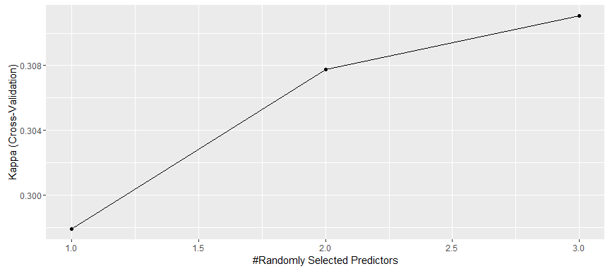
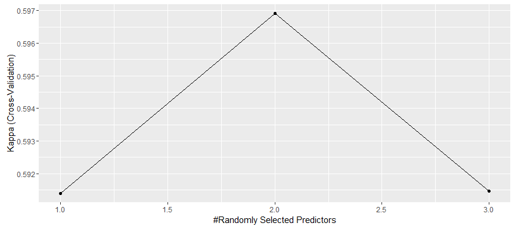

# TD 2009: Classification (P vs. D)
Vilmantas Gėgžna  

Document created on: 2016-06-16 04:32:15  
 


Klasifikacija
==============

Šiame pavyzdyje naudojamas atsitiktinių miškų (*angl.* Random forests)
klasifikatorius (10 tūkst. sprendimų medžių).   

Rezultatų patikrinimas vykdomas (kryžminio) skaidymo į **5** dalis metodu
(*angl.* 5-fold cross-validation).


Rezultatai kiekvienam išskaydymo variantui
-------------------------------------------


```
## Loading required package: e1071
```

  


### Results of Fold 1

  

    
```
 Parallel Random Forest 
 
 758 samples
  13 predictor
   3 classes: 'D', 'P', 'S' 
 
 Pre-processing: centered (5), scaled (5) 
 Resampling: Cross-Validated (5 fold, repeated 5 times) 
 Summary of sample sizes: 606, 606, 606, 607, 607, 606, ... 
 Resampling results across tuning parameters:
 
   mtry  Accuracy   Kappa    
   2     0.9533004  0.9281439
   3     0.9577811  0.9351315
   5     0.9569812  0.9339108
 
 Kappa was used to select the optimal model using  the largest value.
 The final value used for the model was mtry = 3. 
```

    
```
 [1] "spcc408nm" "spcc415nm" "spcc476nm" "Boos"      "Safranin" 
```

    
```
 Confusion Matrix and Statistics
 
           Reference
 Prediction  D  P  S
          D 36 30  4
          P 27 89  0
          S 31  8 35
 
 Overall Statistics
                                           
                Accuracy : 0.6154          
                  95% CI : (0.5533, 0.6748)
     No Information Rate : 0.4885          
     P-Value [Acc > NIR] : 2.617e-05       
                                           
                   Kappa : 0.4009          
  Mcnemar's Test P-Value : 2.254e-06       
 
 Statistics by Class:
 
                      Class: D Class: P Class: S
 Sensitivity            0.3830   0.7008   0.8974
 Specificity            0.7952   0.7970   0.8235
 Pos Pred Value         0.5143   0.7672   0.4730
 Neg Pred Value         0.6947   0.7361   0.9785
 Prevalence             0.3615   0.4885   0.1500
 Detection Rate         0.1385   0.3423   0.1346
 Detection Prevalence   0.2692   0.4462   0.2846
 Balanced Accuracy      0.5891   0.7489   0.8605
```

    


### Results of Fold 2

  

    
```
 Parallel Random Forest 
 
 799 samples
  13 predictor
   3 classes: 'D', 'P', 'S' 
 
 Pre-processing: centered (5), scaled (5) 
 Resampling: Cross-Validated (5 fold, repeated 5 times) 
 Summary of sample sizes: 639, 640, 639, 639, 639, 639, ... 
 Resampling results across tuning parameters:
 
   mtry  Accuracy   Kappa    
   2     0.9323992  0.8975985
   3     0.9321492  0.8972311
   5     0.9306461  0.8949317
 
 Kappa was used to select the optimal model using  the largest value.
 The final value used for the model was mtry = 2. 
```

    
```
 [1] "spcc408nm" "spcc415nm" "spcc476nm" "Boos"      "Safranin" 
```

    
```
 Confusion Matrix and Statistics
 
           Reference
 Prediction  D  P  S
          D 45  0 45
          P 31 64  0
          S 33  0  1
 
 Overall Statistics
                                           
                Accuracy : 0.5023          
                  95% CI : (0.4341, 0.5704)
     No Information Rate : 0.4977          
     P-Value [Acc > NIR] : 0.473           
                                           
                   Kappa : 0.2175          
  Mcnemar's Test P-Value : NA              
 
 Statistics by Class:
 
                      Class: D Class: P Class: S
 Sensitivity            0.4128   1.0000 0.021739
 Specificity            0.5909   0.8000 0.809249
 Pos Pred Value         0.5000   0.6737 0.029412
 Neg Pred Value         0.5039   1.0000 0.756757
 Prevalence             0.4977   0.2922 0.210046
 Detection Rate         0.2055   0.2922 0.004566
 Detection Prevalence   0.4110   0.4338 0.155251
 Balanced Accuracy      0.5019   0.9000 0.415494
```

    


### Results of Fold 3

  

    
```
 Parallel Random Forest 
 
 780 samples
  13 predictor
   3 classes: 'D', 'P', 'S' 
 
 Pre-processing: centered (5), scaled (5) 
 Resampling: Cross-Validated (5 fold, repeated 5 times) 
 Summary of sample sizes: 624, 624, 624, 624, 624, 623, ... 
 Resampling results across tuning parameters:
 
   mtry  Accuracy   Kappa    
   2     0.9671727  0.9491074
   3     0.9694771  0.9527189
   5     0.9702480  0.9539209
 
 Kappa was used to select the optimal model using  the largest value.
 The final value used for the model was mtry = 5. 
```

    
```
 [1] "spcc408nm" "spcc415nm" "spcc476nm" "Boos"      "Safranin" 
```

    
```
 Confusion Matrix and Statistics
 
           Reference
 Prediction   D   P   S
          D   0 112   0
          P  14  44   0
          S   2   0  66
 
 Overall Statistics
                                           
                Accuracy : 0.4622          
                  95% CI : (0.3976, 0.5278)
     No Information Rate : 0.6555          
     P-Value [Acc > NIR] : 1               
                                           
                   Kappa : 0.2627          
  Mcnemar's Test P-Value : NA              
 
 Statistics by Class:
 
                      Class: D Class: P Class: S
 Sensitivity           0.00000   0.2821   1.0000
 Specificity           0.49550   0.8293   0.9884
 Pos Pred Value        0.00000   0.7586   0.9706
 Neg Pred Value        0.87302   0.3778   1.0000
 Prevalence            0.06723   0.6555   0.2773
 Detection Rate        0.00000   0.1849   0.2773
 Detection Prevalence  0.47059   0.2437   0.2857
 Balanced Accuracy     0.24775   0.5557   0.9942
```

    


### Results of Fold 4

  

    
```
 Parallel Random Forest 
 
 892 samples
  13 predictor
   3 classes: 'D', 'P', 'S' 
 
 Pre-processing: centered (5), scaled (5) 
 Resampling: Cross-Validated (5 fold, repeated 5 times) 
 Summary of sample sizes: 714, 714, 713, 714, 713, 713, ... 
 Resampling results across tuning parameters:
 
   mtry  Accuracy   Kappa    
   2     0.9589666  0.9372639
   3     0.9636832  0.9444985
   5     0.9598705  0.9386579
 
 Kappa was used to select the optimal model using  the largest value.
 The final value used for the model was mtry = 3. 
```

    
```
 [1] "spcc408nm" "spcc415nm" "spcc476nm" "Boos"      "Safranin" 
```

    
```
 Confusion Matrix and Statistics
 
           Reference
 Prediction  D  P  S
          D  2 24 20
          P 25 24  0
          S 31  0  0
 
 Overall Statistics
                                           
                Accuracy : 0.2063          
                  95% CI : (0.1394, 0.2875)
     No Information Rate : 0.4603          
     P-Value [Acc > NIR] : 1               
                                           
                   Kappa : -0.2309         
  Mcnemar's Test P-Value : NA              
 
 Statistics by Class:
 
                      Class: D Class: P Class: S
 Sensitivity           0.03448   0.5000   0.0000
 Specificity           0.35294   0.6795   0.7075
 Pos Pred Value        0.04348   0.4898   0.0000
 Neg Pred Value        0.30000   0.6883   0.7895
 Prevalence            0.46032   0.3810   0.1587
 Detection Rate        0.01587   0.1905   0.0000
 Detection Prevalence  0.36508   0.3889   0.2460
 Balanced Accuracy     0.19371   0.5897   0.3538
```

    


### Results of Fold 5

  

    
```
 Parallel Random Forest 
 
 843 samples
  13 predictor
   3 classes: 'D', 'P', 'S' 
 
 Pre-processing: centered (5), scaled (5) 
 Resampling: Cross-Validated (5 fold, repeated 5 times) 
 Summary of sample sizes: 675, 675, 673, 675, 674, 674, ... 
 Resampling results across tuning parameters:
 
   mtry  Accuracy   Kappa    
   2     0.9480478  0.9206921
   3     0.9504146  0.9243029
   5     0.9494792  0.9228792
 
 Kappa was used to select the optimal model using  the largest value.
 The final value used for the model was mtry = 3. 
```

    
```
 [1] "spcc408nm" "spcc415nm" "spcc476nm" "Boos"      "Safranin" 
```

    
```
 Confusion Matrix and Statistics
 
           Reference
 Prediction  D  P  S
          D  0  0 53
          P 18 23 39
          S 13  0 29
 
 Overall Statistics
                                           
                Accuracy : 0.2971          
                  95% CI : (0.2305, 0.3708)
     No Information Rate : 0.6914          
     P-Value [Acc > NIR] : 1               
                                           
                   Kappa : 0.0243          
  Mcnemar's Test P-Value : <2e-16          
 
 Statistics by Class:
 
                      Class: D Class: P Class: S
 Sensitivity            0.0000   1.0000   0.2397
 Specificity            0.6319   0.6250   0.7593
 Pos Pred Value         0.0000   0.2875   0.6905
 Neg Pred Value         0.7459   1.0000   0.3083
 Prevalence             0.1771   0.1314   0.6914
 Detection Rate         0.0000   0.1314   0.1657
 Detection Prevalence   0.3029   0.4571   0.2400
 Balanced Accuracy      0.3160   0.8125   0.4995
```

  


Bendro tikslumo apibendrinimas
------------------------------


--------------------------
 Pakartojimas   Tikslumas 
-------------- -----------
      1          0.6154   

      2          0.5023   

      3          0.4622   

      4          0.2063   

      5          0.2971   

  vidutinis      0.4167   
--------------------------
<font color="red" size = 4>    
Galutinis atsakymas: **tikslumas = 0.4166689**
</font>  


Pastabos
------------------------------

Taip pat buvo išbandyti ir keli dirbtinių neuroninių tinklų klasifikatoriai. Rezultatai gavosi analogiški.


